# Agente de Soporte al Cliente

Práctica de la **Unidad 2** — Mi Primer Agente de IA
Construcción de un agente de soporte con Python y Gemini

| | |
|---|---|
| **Alumno** | Ricardo Nuñez Hernandez |
| **No. de control** | 23070505 |
| **Materia** | Desarrollo de Agentes Inteligentes (ACD-2504) |
| **Grupo** | 850P-A |
| **Carrera** | Ingeniería en Sistemas Computacionales |
| **Institución** | TecNM campus Ciudad Madero |
| **Fecha** | 7 de octubre de 2026 |

Un agente que vigila un formulario de quejas, clasifica cada comentario con un
modelo de lenguaje y escribe el resultado de vuelta en la misma hoja de cálculo.
Sin que nadie lo toque, cada 15 minutos.

---

## 1. Resultado

### 1.1 Las tres quejas iniciales

Tres quejas enviadas por el formulario, clasificadas por Gemini en una sola corrida:

| Correo | Comentario | Clasificación IA | Sentimiento IA |
|---|---|---|---|
| ana@ejemplo.com | Mi pedido llegó una semana tarde y la caja venía rota | Logística | Negativo |
| carlos@ejemplo.com | La aplicación se cierra sola cada vez que intento iniciar sesión | Soporte Técnico | Negativo |
| maria@ejemplo.com | Me cobraron dos veces el mismo pedido, necesito la devolución | Ventas | Negativo |

`Resumen: 3 procesada(s), 0 con error.`

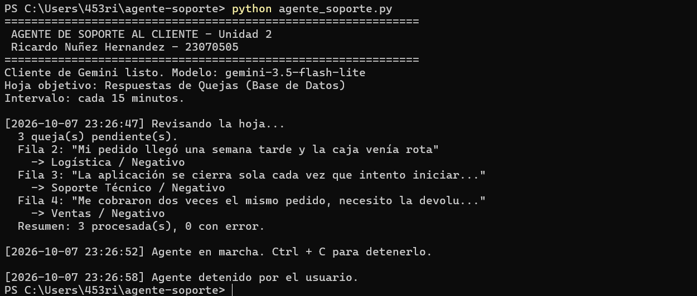

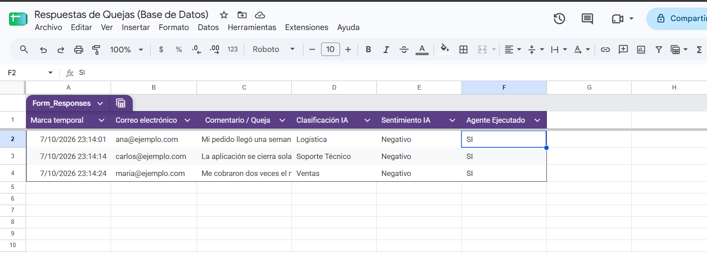

### 1.2 Ejecución autónoma

La corrida anterior la lanzó una persona. Ésta no.

El agente se dejó corriendo y, con él ya en marcha, se envió una cuarta
respuesta por el formulario. Nadie volvió a tocar la terminal: el ciclo de
`schedule` despertó solo quince minutos después, encontró la fila nueva y la
procesó.

| Marca de tiempo | Qué pasó |
|---|---|
| `23:37:40` | Primera pasada, lanzada a mano: *"Sin quejas nuevas. Nada que hacer."* |
| `23:37:41` | El agente queda en marcha y se duerme |
| *(en medio)* | Llega la cuarta queja por el formulario |
| `23:53:11` | **El agente despierta solo**, encuentra 1 pendiente y la clasifica |

| Correo | Comentario | Clasificación IA | Sentimiento IA |
|---|---|---|---|
| jorge@ejemplo.com | Gracias, el soporte me resolvió el problema en minutos, excelente atención | Soporte Técnico | **Positivo** |

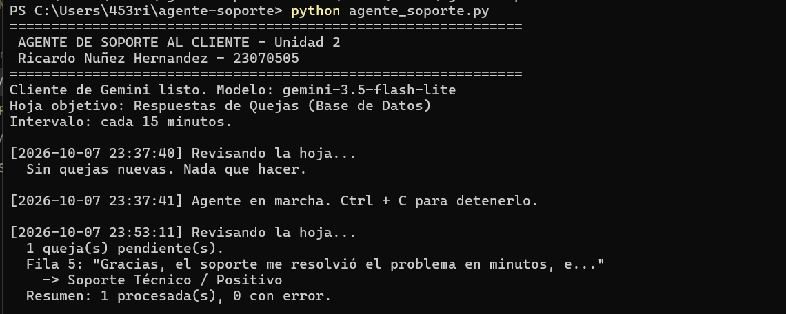

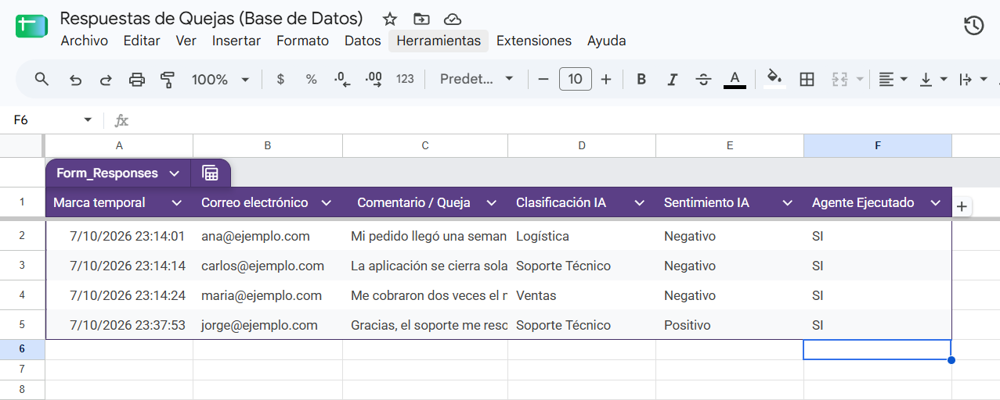

Esta evidencia demuestra dos cosas que la anterior no podía:

1. **El agente trabaja sin supervisión.** Entre `23:37:41` y `23:53:11` nadie
   tocó el teclado. Lo único que disparó la segunda pasada fue el intervalo de
   `schedule`. Los 31 segundos de más sobre los quince minutos exactos son la
   granularidad del `time.sleep(30)` del bucle principal.
2. **El sentimiento no está fijo.** Las tres primeras quejas salieron
   `Negativo` porque las tres eran reclamos. Un comentario de agradecimiento
   sale `Positivo`, y la clasificación sigue siendo `Soporte Técnico`:
   categoría y sentimiento se deciden por separado.

---

## 2. Arquitectura

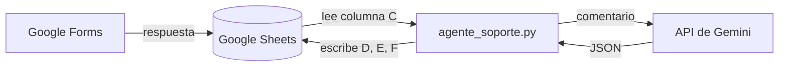

| Pieza | Papel |
|---|---|
| **Google Forms** | Captura la queja del cliente. Dos campos: correo y comentario. |
| **Google Sheets** | Base de datos. El formulario escribe A, B y C; el agente escribe D, E y F. |
| **`agente_soporte.py`** | El agente. Lee, decide, escribe y se vuelve a dormir 15 minutos. |
| **Gemini** | El clasificador. Recibe un comentario y devuelve dos etiquetas en JSON. |
| **`gspread`** | Puente con Google. Maneja el OAuth y las operaciones sobre celdas. |
| **`schedule`** | El reloj. Dispara el ciclo cada `INTERVALO_MINUTOS`. |

La hoja se llama exactamente **`Respuestas de Quejas (Base de Datos)`**, con esta estructura:

| A | B | C | D | E | F |
|---|---|---|---|---|---|
| Marca temporal | Correo electrónico | Comentario / Queja | Clasificación IA | Sentimiento IA | Agente Ejecutado |
| *(Formulario)* | *(Formulario)* | *(Formulario)* | *(Agente)* | *(Agente)* | *(Agente)* |

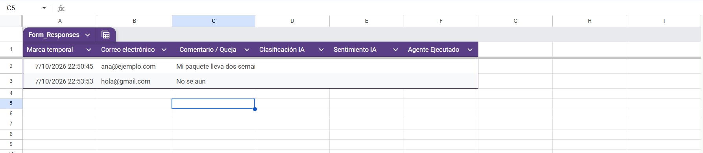

**Categorías:** Ventas · Soporte Técnico · Logística
**Sentimientos:** Positivo · Negativo · Neutro

---

## 3. Estructura del repositorio

```
.
├── agente_soporte.py     el agente
├── prueba_agente.py      50 pruebas automatizadas
├── requirements.txt      dependencias
├── .env.ejemplo          plantilla de configuración
├── .gitignore            excluye las credenciales
├── evidencia/            capturas del proceso
└── README.md
```

---

## 4. Instalación y configuración

### 4.1 Dependencias

```bash
pip install -r requirements.txt
```

O directamente:

```bash
pip install gspread google-auth google-genai schedule python-dotenv
```

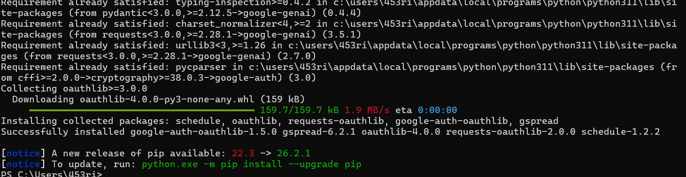

### 4.2 El formulario y la hoja

1. Crear un formulario en Google Forms con dos preguntas: **Correo electrónico**
   (respuesta corta) y **Comentario / Queja** (párrafo, obligatoria).
2. En **Configuración → Respuestas**, dejar **apagado** *"Recopilar direcciones
   de correo electrónico"*. Si se enciende, Google agrega su propia columna de
   correo además de la pregunta, el comentario se recorre a la D, y el agente
   acabaría leyendo un correo como si fuera la queja.
3. En la pestaña **Respuestas**, crear la hoja de cálculo enlazada. Tiene que
   nacer de ahí: una hoja creada aparte no recibe las respuestas.
4. Renombrar el **archivo** (no la pestaña) a `Respuestas de Quejas (Base de Datos)`.
   El script abre la hoja por el nombre del archivo; la pestaña puede llamarse
   como sea, porque el código usa `.sheet1`.
5. Escribir a mano los encabezados **D1**, **E1** y **F1**.

> **Problema encontrado.** En el primer intento apareció una columna
> `Puntuación` en la D, que empujó los encabezados a E, F y G. La crea Google
> cuando el formulario está en **modo cuestionario**. Se resolvió apagando esa
> opción en la configuración del formulario y borrando la columna.
>
> 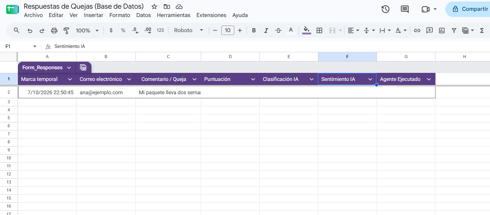

### 4.3 Credenciales de Google Cloud

1. Crear un proyecto en [Google Cloud Console](https://console.cloud.google.com).
2. Habilitar **Google Sheets API** y **Google Drive API**.
   La de Drive no es opcional: buscar un archivo **por su nombre**
   (`cliente.open(...)`) es una operación de Drive, no de Sheets. Sin ella el
   script falla con `403` al abrir la hoja.
3. Pantalla de consentimiento: tipo **Externo**, y agregarse a uno mismo como
   **usuario de prueba**. Sin ese paso la autorización rebota con
   `Error 403: access_denied`.
4. Credenciales → **ID de cliente de OAuth** → **Aplicación de escritorio**.
   Si se elige "Aplicación web" el script falla con `redirect_uri_mismatch`.
5. Descargar el JSON, renombrarlo `client_secrets.json` y dejarlo junto al script.

Para comprobar que el tipo es el correcto, sin exponer nada:

```bash
python -c "import json; d = json.load(open('client_secrets.json')); print('tipo:', list(d.keys())[0])"
```

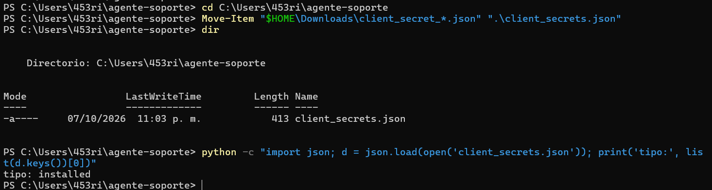

`installed` significa aplicación de escritorio. Si imprime `web`, hay que
volver a crear la credencial.

### 4.4 La API Key de Gemini

Copiar `.env.ejemplo` como `.env` y poner la clave de
[Google AI Studio](https://aistudio.google.com/apikey):

```
GEMINI_API_KEY=tu_clave_de_gemini
```

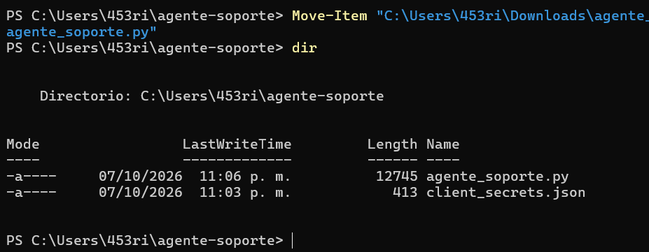

---

## 5. Uso

### Modo simulado

```bash
python agente_soporte.py --simulado
```

Clasifica con un buscador de palabras clave en vez de llamar a Gemini. Sirve
para probar la conexión con Google —autorización, lectura y escritura— **sin
gastar nada de la cuota diaria**. Sigue necesitando `client_secrets.json`,
porque sí escribe en la hoja.

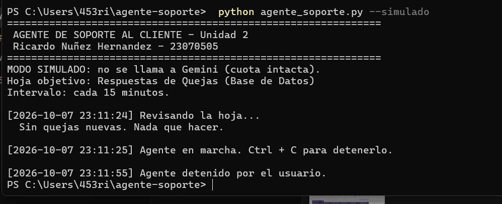

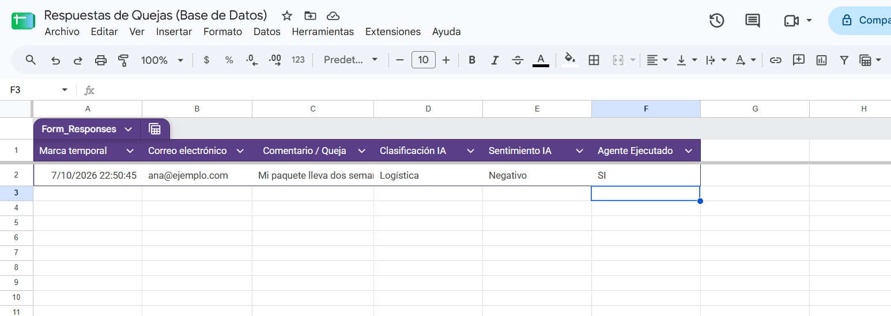

La segunda corrida de esa captura dice *"Sin quejas nuevas. Nada que hacer"*:
la fila ya trae `SI` en la columna F y el agente la ignora. Es el mecanismo que
evita reprocesar lo mismo cada 15 minutos.

### Modo real

```bash
python agente_soporte.py
```

La primera vez abre el navegador para autorizar la cuenta. El permiso queda
guardado en `token_usuario.json` y las siguientes corridas ya no lo piden.

Después de la primera pasada, el agente queda vivo y repite el ciclo cada 15
minutos hasta que se le dé `Ctrl + C`.

---

## 6. Cómo funciona el código

| Función | Qué hace |
|---|---|
| `conectar_sheets()` | Abre la hoja por su nombre y devuelve la primera pestaña. |
| `analizar_con_gemini(comentario)` | Manda el comentario al modelo y devuelve `{"clasificacion", "sentimiento"}` ya validado. |
| `analizar_simulado(comentario)` | Clasificador de palabras clave para el modo `--simulado`. |
| `ejecutar_agente()` | Una pasada completa: leer la hoja, analizar lo pendiente, escribir. |
| `filas_pendientes(filas)` | Decide qué filas faltan: salta encabezado, vacías, ya marcadas y fallidas. |
| `limpiar_json(texto)` | Quita las cercas ``` que el modelo suele agregar. |
| `valor_permitido(valor, permitidos, etiqueta)` | Valida la etiqueta contra la lista permitida. |
| `normalizar(texto)` | Minúsculas y sin acentos, para comparar. |
| `celda(fila, indice)` | Lee una celda tolerando filas cortas. |

### Decisiones que vale la pena explicar

**El código valida, el prompt sólo pide.** El prompt pide las tres categorías,
pero `valor_permitido()` verifica que la respuesta sea realmente una de ellas.
Si el modelo inventa un "Devoluciones", se lanza un `ValueError` y la fila se
queda sin marcar, en lugar de ensuciar la hoja con una categoría que no existe.

**La columna F se escribe al final.** Primero D, luego E, y hasta el final el
`SI`. Si el programa se cae a media fila, esa fila sigue contando como
pendiente y se vuelve a procesar. Al revés se habría perdido el dato.

**`celda()` existe por una razón concreta.** `get_all_values()` recorta las
columnas vacías del final, así que una queja recién llegada del formulario
llega como una lista de **tres** elementos, no de seis. Un `fila[5]` directo
reventaría con `IndexError`.

**El JSON se limpia antes de parsearlo.** Aunque se pide
`response_mime_type="application/json"`, `limpiar_json()` sigue ahí como red de
seguridad por si el modelo devuelve el objeto envuelto en ``` o ```json.

---

## 7. Manejo de errores y protección de la cuota

La capa gratuita de Gemini da **20 peticiones al día**, contadas por proyecto y
por modelo. El agente está construido alrededor de ese límite:

| Situación | Qué hace el agente |
|---|---|
| Gemini falla en una fila | Registra el error, **no marca la fila** y no la reintenta hasta reiniciar |
| Falla la escritura en Sheets | Igual: la fila queda pendiente, sin datos a medias |
| No se puede leer la hoja | Avisa y termina la pasada sin tumbar el programa |
| Hay más de 10 filas pendientes | Procesa 10 y deja el resto para la corrida siguiente |
| El modelo inventa una categoría | `ValueError`, la fila no se marca |

El conjunto `filas_con_error` es deliberadamente **en memoria**: una fila que
falló no se reintenta mientras el proceso siga vivo. Sin eso, una fila
problemática se reintentaría cada 15 minutos y se comería la cuota del día en
bucle.

`MAX_ANALISIS_POR_CORRIDA = 10` es el mismo seguro desde el otro lado: si
llegaran 40 quejas de golpe, una sola corrida agotaría las 20 llamadas.

### Esto se probó en la práctica, no en teoría

La primera ejecución real falló con `404 NOT_FOUND` en las tres filas:

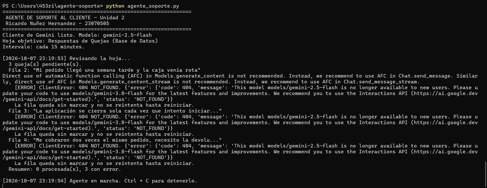

Y la hoja quedó **intacta**: ni una celda escrita, ni una fila marcada:

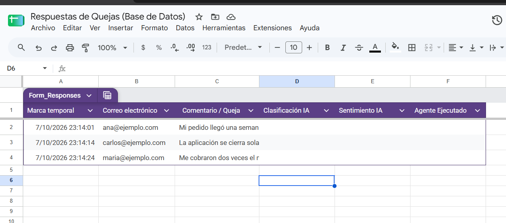

`Resumen: 0 procesada(s), 3 con error.` Un script sin ese manejo habría dejado
la hoja a medio llenar, o habría tronado en la primera fila sin tocar las otras
dos.

---

## 8. Desviaciones respecto al documento de la práctica

| # | Desviación | Motivo |
|---|---|---|
| 1 | Modelo `gemini-3.5-flash-lite` en vez de `gemini-2.5-flash` | Google retiró `gemini-2.5-flash` para cuentas nuevas: *"This model is no longer available to new users"*. El reemplazo que Google sugiere, `gemini-3.8-flash`, respondió `503 UNAVAILABLE` por saturación en 2 de 3 llamadas. `gemini-3.5-flash-lite` procesó las tres sin un solo error. |
| 2 | Se agregó `python-dotenv` | Para que la API Key viva en un `.env` y no escrita dentro del código fuente. El import es opcional: si la librería no está, el script usa la variable de entorno del sistema. |
| 3 | `retry_options=HttpRetryOptions(attempts=2)` | Cada reintento del SDK consume cuota. Con el valor por defecto, un modelo saturado agota las 20 llamadas del día en una sola fila. |
| 4 | `ARCHIVO_TOKEN = "token_usuario.json"` | Guarda el permiso de Google para que el navegador sólo se abra la primera vez. |
| 5 | `filas_con_error` | Evita el bucle de reintentos descrito en la sección 7. |
| 6 | `MAX_ANALISIS_POR_CORRIDA = 10` | Tope de llamadas por pasada. |
| 7 | Modo `--simulado` | Permite probar toda la integración con Google sin gastar cuota. |

Las desviaciones 4 a 7 son añadidos: no modifican nada de lo que el documento
pide, sólo agregan comportamiento alrededor.

---

## 9. Pruebas automatizadas

```bash
python prueba_agente.py
```

**50 aserciones**, todas pasando. Cubren la limpieza del JSON, la normalización
de acentos y mayúsculas, el rechazo de categorías inventadas, el filtrado de
filas, el orden de escritura D→E→F, la ruta de error de Gemini, la ruta de
error de Sheets, el tope por corrida y el modo simulado.

> **Alcance de estas pruebas.** `gspread`, `schedule`, `dotenv` y `google-genai`
> se sustituyen por dobles de prueba registrados en `sys.modules`, y la hoja de
> cálculo es un objeto falso. Eso ejercita toda la lógica del agente, pero **no**
> verifica la conexión real con Google ni con Gemini. Esa comprobación es la
> ejecución real documentada en la sección 1.

---

## 10. Seguridad

Tres archivos **nunca** entran al repositorio, y están en `.gitignore`:

| Archivo | Qué es |
|---|---|
| `.env` | La API Key de Gemini |
| `client_secrets.json` | El secreto OAuth de la aplicación |
| `token_usuario.json` | El permiso de acceso a Google Drive y Sheets |

El tercero es el más delicado: no es una contraseña, es una llave ya girada.
Quien lo tenga entra a los archivos de Google de la cuenta.

> **El token caduca a los 7 días.** Mientras la aplicación esté en estado
> *"Prueba"* en Google Cloud, Google invalida el permiso cada semana. Si el
> script vuelve a abrir el navegador, no está roto: se borra
> `token_usuario.json`, se autoriza otra vez y sigue.

---

## 11. Declaración de uso de inteligencia artificial

Esta práctica se desarrolló con asistencia de IA (Claude), con autorización
expresa del profesor de la materia.

**Lo que hizo la IA:** escribió `agente_soporte.py` y `prueba_agente.py`,
redactó este README, diagnosticó los errores encontrados durante el proceso
(la columna `Puntuación`, el `404` del modelo retirado, el `503` por
saturación) y guió la configuración paso a paso.

**Lo que hizo el alumno:** toda la configuración en el navegador (formulario,
hoja de cálculo, proyecto de Google Cloud, APIs, pantalla de consentimiento y
credenciales), la custodia de las credenciales y **todas** las ejecuciones del
script. Las capturas de la carpeta `evidencia/` son corridas reales en su
máquina.

La IA no tuvo acceso en ningún momento a la cuenta de Google, a la API Key ni a
la hoja de cálculo del alumno. Las pruebas automatizadas que escribió se
ejecutan contra dobles de prueba, no contra los servicios reales; la
verificación de punta a punta es la ejecución documentada en la sección 1.
